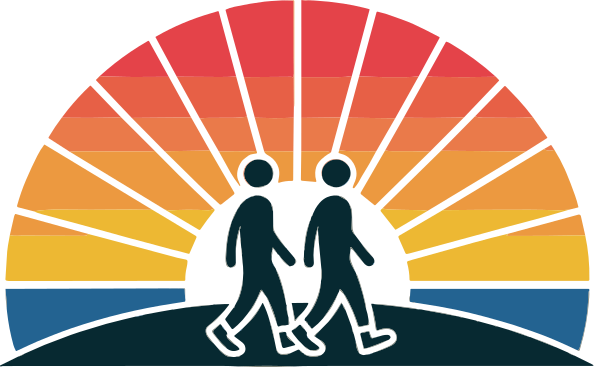

<div align="center">
 <h1><br/>FriendScope</h1>
 <h3>Scientific Friendship Assessment Tool</h3>
 <a href="https://friendscope.vercel.app" target="_blank"></a>
 
  
 
 
</div>

<br/>

# ✨ Key Features

### 🔍 Scientific Assessment
- Comprehensive questionnaire based on psychological research
- Evaluates 10 key aspects of friendship including trust, communication, and emotional support
- Evidence-based scoring and analysis

### 📊 Visual Analytics
- Interactive charts showing different aspects of friendship
- Real-time visualization of assessment results
- Historical trend analysis and comparisons

### 🎯 Personalized Insights
- Tailored recommendations based on assessment results
- Detailed analysis of friendship strengths and areas for improvement
- Scientific explanations for all recommendations

### 🔐 Privacy-First
- No account required
- All data stored locally
- Complete anonymity in assessments

### 💫 Modern UX/UI
- Smooth animations and transitions
- Interactive and responsive design
- Intuitive user flow

### 📱 Cross-Platform
- Fully responsive design
- Works on all modern browsers
- Optimized for both desktop and mobile

## 🛠️ Tech Stack

### Core
- **Framework**: Next.js 15 with TypeScript
- **Styling**: Tailwind CSS
- **UI Components**: shadcn/ui
- **State Management**: Zustand with persist middleware

### Visualization
- **Charts**: Recharts, Apexcharts
- **Animations**: Framer Motion
- **Icons**: Lucide React
- **Motion Graphics**: Lottie Animations

### Additional Libraries
- **Date Handling**: date-fns
- **PDF Generation**: jsPDF
- **UUID Generation**: uuid

## 🚀 Getting Started

### Prerequisites
- Node.js (version 18.17.0 or higher)
- npm or yarn

### Installation
```bash
# Clone the repository
git clone https://github.com/ChanMeng666/friendscope.git
cd friendscope

# Install dependencies
npm install
# or
yarn install

# Start development server
npm run dev
# or
yarn dev
```

Visit [http://localhost:3000](http://localhost:3000) to see the application.

## 📁 Project Structure
```
friendscope/
├── app/                 # Next.js app directory
│   ├── about/          # About page
│   ├── assess/         # Assessment flow
│   ├── results/        # Results visualization
│   └── page.tsx        # Home page
├── components/         # React components
│   ├── ui/            # Reusable UI components
│   └── layout/        # Layout components
├── lib/               # Utilities and stores
├── hooks/             # Custom hooks
└── public/            # Static assets
```

## ⚙️ Core Features Explained

### Scientific Assessment Process
- Evaluates 10 key aspects of friendship
- Research-based questionnaire design
- Complex scoring algorithms
- Personalized result analysis

### Visualization System
- Radar charts for aspect analysis
- Trend visualization for progress tracking
- Interactive data exploration
- Comparative analysis tools

### Data Management
- Local storage system
- Export functionality (PDF/SVG)
- Historical tracking
- Progress monitoring

### User Experience
- Smooth transitions
- Responsive design
- Intuitive navigation
- Real-time feedback

## 🤝 Contributing

Contributions are welcome! Please feel free to submit a Pull Request.

1. Fork the repository
2. Create your feature branch (`git checkout -b feature/AmazingFeature`)
3. Commit your changes (`git commit -m 'Add some AmazingFeature'`)
4. Push to the branch (`git push origin feature/AmazingFeature`)
5. Open a Pull Request

## 📄 License

This project is licensed under the MIT License - see the [LICENSE](LICENSE) file for details.

## 🙏 Acknowledgments

- UI components inspired by [shadcn/ui](https://ui.shadcn.com/)
- Icons provided by [Lucide](https://lucide.dev/)
- Animation assets from [LottieFiles](https://lottiefiles.com/)

## Author

**Chan Meng**
- LinkedIn: [chanmeng666](https://www.linkedin.com/in/chanmeng666/)
- GitHub: [ChanMeng666](https://github.com/ChanMeng666)

## ⚡ Tech Used


